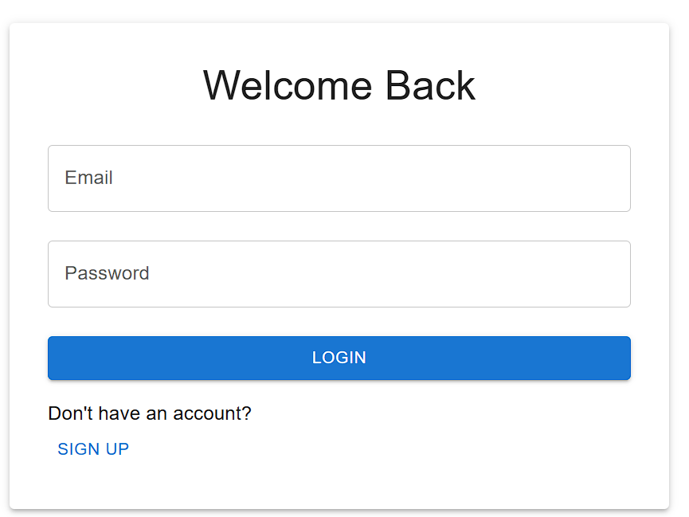
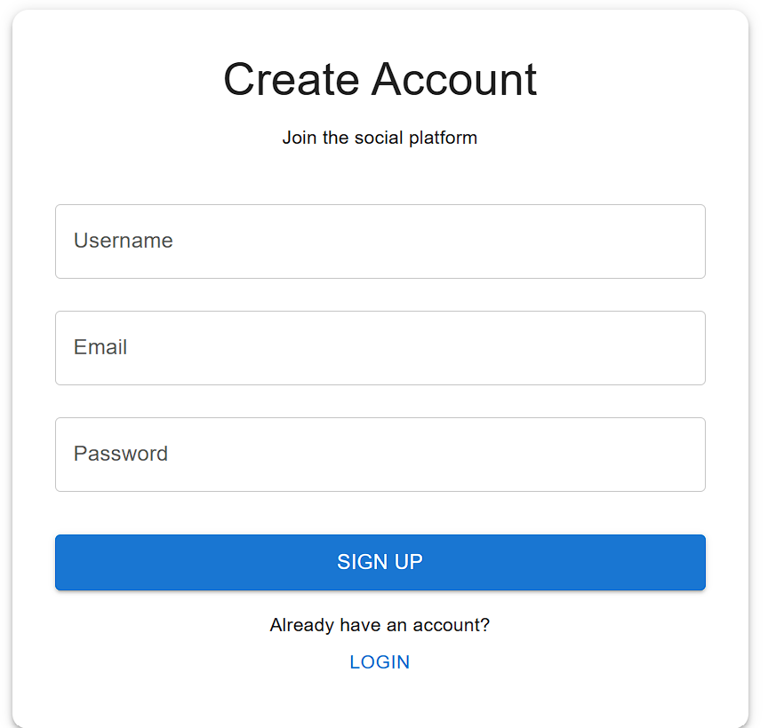
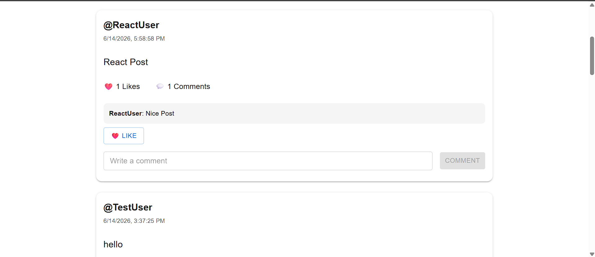
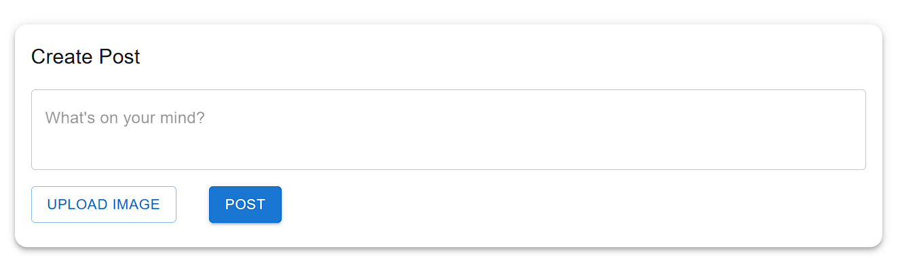
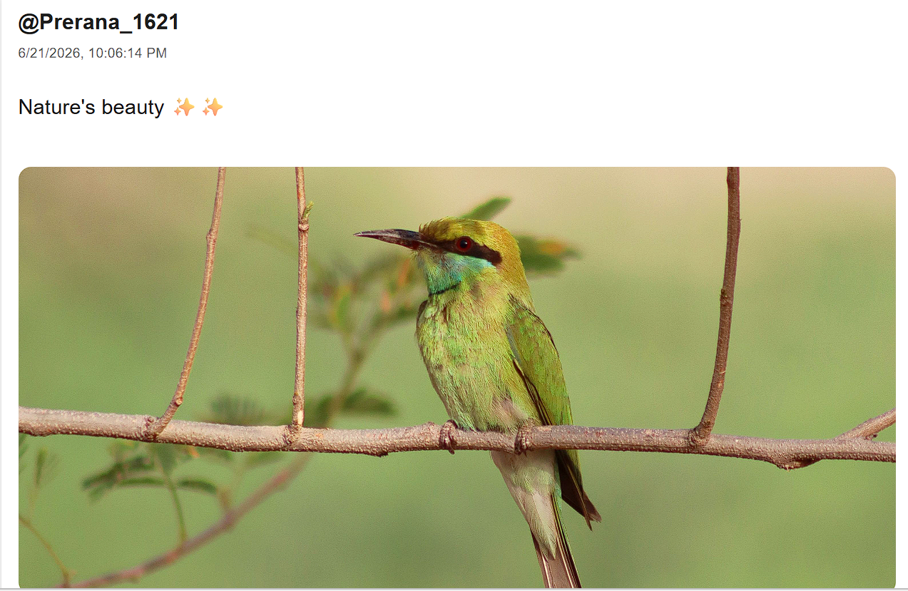

# Mini Social Feed App 🚀


A full-stack social media application built with the **MERN Stack** where users can sign up, log in, create posts, upload images, like posts, and comment on posts.

---

## 🌐 Live Demo

[](https://social-post-app-ashy.vercel.app)

[](https://social-post-app-ke8i.onrender.com)

---

## 📂 GitHub Repository

https://github.com/prerana1621/social-post-app

---

## ✨ Features

| Feature | Status |
|---------|---------|
| User Signup | ✅ |
| User Login | ✅ |
| JWT Authentication | ✅ |
| Protected Routes | ✅ |
| Create Text Posts | ✅ |
| Upload Images | ✅ |
| Create Text + Image Posts | ✅ |
| Like Posts | ✅ |
| Comment on Posts | ✅ |
| Real-Time Feed Updates | ✅ |
| Logout | ✅ |
| Loading States | ✅ |
| Responsive Material UI Interface | ✅ |
| Delete Posts | 🚧 Planned |
| Edit Posts | 🚧 Planned |
| User Profiles | 🚧 Planned |
| Dark Mode | 🚧 Planned |

---

## 📸 Screenshots

### Login Page



---

### Signup Page



---

### Social Feed



---

### Creating a Post



---

### Uploading Images



---

## 🛠️ Tech Stack

| Category | Technologies |
|----------|---------------|
| Frontend | React, React Router DOM, Axios, Material UI, Vite |
| Backend | Node.js, Express.js |
| Database | MongoDB, Mongoose |
| Authentication | JWT |
| File Upload | Multer |
| Deployment | Vercel, Render, MongoDB Atlas |

---

## 📖 About The Project

Mini Social Feed is a full-stack social media application that demonstrates the fundamentals of modern web development using the MERN stack.

The application allows users to:

- Create an account
- Log in securely
- Create text posts
- Upload images
- Like posts
- Comment on posts
- View all posts in real time

This project was built to practice:

- Full-Stack MERN Development
- REST API Development
- Authentication and Authorization
- Image Upload Handling
- Frontend and Backend Integration
- State Management
- Git and GitHub Workflow
- Deployment

---

## 📁 Project Structure

```text
SOCIAL-POST-APP
│
├── backend
│   ├── config
│   │   └── db.js
│   │
│   ├── controllers
│   │   ├── authController.js
│   │   └── postController.js
│   │
│   ├── middleware
│   │   ├── authMiddleware.js
│   │   └── uploadMiddleware.js
│   │
│   ├── models
│   │   ├── Post.js
│   │   └── User.js
│   │
│   ├── routes
│   │   ├── authRoutes.js
│   │   └── postRoutes.js
│   │
│   ├── uploads
│   │   └── .gitkeep
│   │
│   ├── .env
│   ├── .gitignore
│   ├── package.json
│   ├── package-lock.json
│   └── server.js
│
├── frontend
│   ├── public
│   ├── src
│   │   ├── assets
│   │   ├── pages
│   │   │   ├── Feed.jsx
│   │   │   ├── Login.jsx
│   │   │   └── Signup.jsx
│   │   │
│   │   ├── services
│   │   │   └── api.js
│   │   │
│   │   ├── App.css
│   │   ├── App.jsx
│   │   ├── index.css
│   │   └── main.jsx
│   │
│   ├── .gitignore
│   ├── eslint.config.js
│   ├── index.html
│   ├── package.json
│   ├── package-lock.json
│   └── vite.config.js
│
├── screenshots
│   ├── login.png
│   ├── signup.png
│   ├── feed.png
│   ├── create-post.png
│   └── image-post.png
│
└── README.md
```

---

## ⚙️ Installation

### Clone Repository

```bash
git clone https://github.com/prerana1621/social-post-app.git
cd social-post-app
```

---

## Backend Setup

```bash
cd backend
npm install
```

Create a `.env` file:

```env
PORT=5000
MONGO_URI=your_mongodb_connection_string
JWT_SECRET=your_secret_key
```

Start the backend server:

```bash
npm run dev
```

Backend runs on:

```text
http://localhost:5000
```

---

## Frontend Setup

```bash
cd frontend
npm install
npm run dev
```

Frontend runs on:

```text
http://localhost:5173
```

---

## 🔌 API Endpoints

### Authentication

#### Signup

```http
POST /auth/signup
```

#### Login

```http
POST /auth/login
```

---

### Posts

#### Get All Posts

```http
GET /posts
```

#### Create Post

```http
POST /posts
```

Supports:

- Text only
- Image only
- Text + Image

#### Like Post

```http
POST /posts/:id/like
```

#### Add Comment

```http
POST /posts/:id/comment
```

Request Body:

```json
{
  "text": "Nice post!"
}
```

---

## 📚 Learning Outcomes

This project helped me learn:

- React Hooks
- React Router DOM
- Axios API Integration
- Material UI
- Node.js and Express.js
- MongoDB and Mongoose
- JWT Authentication
- Multer File Uploads
- REST API Development
- State Management
- Frontend and Backend Integration
- Git and GitHub Workflow
- Full-Stack MERN Development
- Deployment using Vercel and Render

---

## 🚀 Future Improvements

- Delete Posts
- Edit Posts
- User Profiles
- Dark Mode
- Search Users
- Infinite Scrolling
- Notifications
- Multiple Image Uploads
- Cloudinary Image Storage
- Follow System
- User Profile Pictures

---

## 👩‍💻 Author

**Prerana Acharyya**

Chemical Engineering Undergraduate  
Aspiring Software Developer  
MERN Stack Learner

GitHub: https://github.com/prerana1621

LinkedIn: https://linkedin.com/in/prerana-acharyya-60b1652a1

---

⭐ If you found this project useful, feel free to fork it and give it a star!
